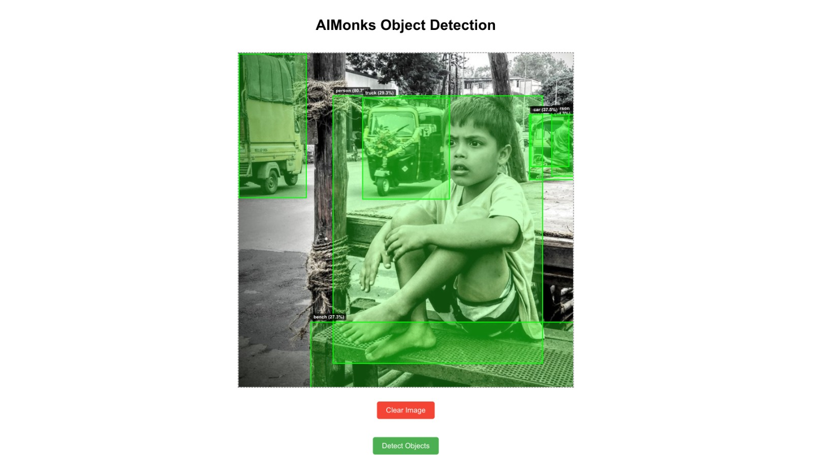

# Object Detection with WEB Based GUI on Docker

## Overview

This project consists of a **Frontend** and a **Backend** application that work together to provide functionality for processing and displaying data. The backend is built with Python (Flask), and the frontend is built with React.

---

## Prerequisites

1. **Docker**: Ensure Docker is installed on your system.
   - Installation guide: [Docker Documentation](https://docs.docker.com/get-docker/)
2. **Git**: Clone this repository.

---

## Setup Instructions

### Clone the Repository

```bash
git clone https://github.com/AnuragSahu/WebBasedObjectDetection.git
cd WebBasedObjectDetection
```

---

## Build and Run the Docker Containers

### Step 1: Build the Docker Images

#### Backend

Navigate to the `backend` directory and build the Docker image:

```bash
cd backend
docker build -t backend-image .
```

#### Frontend

Navigate to the `frontend` directory and build the Docker image:

```bash
cd ../frontend
docker build -t frontend-image .
```

---

### Step 2: Run the Docker Containers

#### Backend Container

Run the backend container using the following command:

```bash
docker run -d --name backend-container -p 5000:5000 backend-image
```

#### Frontend Container

Run the frontend container using the following command:

```bash
docker run -d --name frontend-container -p 3000:3000 frontend-image
```

---

### Step 3: Access the Applications

- **Frontend**: [http://localhost:3000](http://localhost:3000)
- **Backend**: [http://localhost:5000](http://localhost:5000)

---

## Testing the Application

### Example Workflow

1. **Upload an image** using the frontend interface.
2. The backend processes the image and returns results (e.g., bounding boxes).
3. The frontend displays the processed image along with the results.

---

## Add Visual Examples

### 1. Raw Image


### 2. Image with Bounding Boxes




### 3. Response JSON

```json
{
    "detections": [
        {
            "class_id": 0,
            "class_name": "person",
            "confidence": 0.8788350224494934,
            "x1": 12,
            "x2": 118,
            "y1": 79,
            "y2": 182
        },
        {
            "class_id": 0,
            "class_name": "person",
            "confidence": 0.8188568353652954,
            "x1": 313,
            "x2": 447,
            "y1": 156,
            "y2": 250
        },
        {
            "class_id": 0,
            "class_name": "person",
            "confidence": 0.8068395853042603,
            "x1": 329,
            "x2": 426,
            "y1": 69,
            "y2": 162
        },
        {
            "class_id": 0,
            "class_name": "person",
            "confidence": 0.7750809192657471,
            "x1": 80,
            "x2": 178,
            "y1": 70,
            "y2": 157
        },
        {
            "class_id": 41,
            "class_name": "cup",
            "confidence": 0.7569425106048584,
            "x1": 282,
            "x2": 299,
            "y1": 158,
            "y2": 194
        },
        {
            "class_id": 0,
            "class_name": "person",
            "confidence": 0.7057194709777832,
            "x1": 212,
            "x2": 259,
            "y1": 58,
            "y2": 115
        },
        {
            "class_id": 0,
            "class_name": "person",
            "confidence": 0.6300714015960693,
            "x1": 186,
            "x2": 220,
            "y1": 67,
            "y2": 124
        },
        {
            "class_id": 0,
            "class_name": "person",
            "confidence": 0.6295952796936035,
            "x1": 334,
            "x2": 390,
            "y1": 62,
            "y2": 125
        },
        {
            "class_id": 0,
            "class_name": "person",
            "confidence": 0.6046372056007385,
            "x1": 130,
            "x2": 195,
            "y1": 67,
            "y2": 135
        },
        {
            "class_id": 27,
            "class_name": "tie",
            "confidence": 0.575217068195343,
            "x1": 229,
            "x2": 235,
            "y1": 81,
            "y2": 108
        },
        {
            "class_id": 0,
            "class_name": "person",
            "confidence": 0.5720719695091248,
            "x1": 417,
            "x2": 441,
            "y1": 65,
            "y2": 89
        },
        {
            "class_id": 62,
            "class_name": "tv",
            "confidence": 0.5526371002197266,
            "x1": 288,
            "x2": 352,
            "y1": 7,
            "y2": 46
        },
        {
            "class_id": 0,
            "class_name": "person",
            "confidence": 0.5033835768699646,
            "x1": 287,
            "x2": 332,
            "y1": 54,
            "y2": 135
        },
        {
            "class_id": 0,
            "class_name": "person",
            "confidence": 0.3952101767063141,
            "x1": 410,
            "x2": 447,
            "y1": 105,
            "y2": 205
        },
        {
            "class_id": 45,
            "class_name": "bowl",
            "confidence": 0.343274861574173,
            "x1": 115,
            "x2": 162,
            "y1": 211,
            "y2": 247
        },
        {
            "class_id": 58,
            "class_name": "potted plant",
            "confidence": 0.33712872862815857,
            "x1": 143,
            "x2": 169,
            "y1": 15,
            "y2": 67
        },
        {
            "class_id": 41,
            "class_name": "cup",
            "confidence": 0.3244040608406067,
            "x1": 190,
            "x2": 201,
            "y1": 119,
            "y2": 146
        },
        {
            "class_id": 58,
            "class_name": "potted plant",
            "confidence": 0.31934666633605957,
            "x1": 143,
            "x2": 169,
            "y1": 15,
            "y2": 90
        },
        {
            "class_id": 73,
            "class_name": "book",
            "confidence": 0.2940601408481598,
            "x1": 245,
            "x2": 323,
            "y1": 221,
            "y2": 251
        },
        {
            "class_id": 60,
            "class_name": "dining table",
            "confidence": 0.280529260635376,
            "x1": 0,
            "x2": 361,
            "y1": 114,
            "y2": 249
        },
        {
            "class_id": 56,
            "class_name": "chair",
            "confidence": 0.2771742343902588,
            "x1": 0,
            "x2": 22,
            "y1": 102,
            "y2": 180
        },
        {
            "class_id": 0,
            "class_name": "person",
            "confidence": 0.262967586517334,
            "x1": 411,
            "x2": 447,
            "y1": 104,
            "y2": 247
        },
        {
            "class_id": 0,
            "class_name": "person",
            "confidence": 0.2602371573448181,
            "x1": 0,
            "x2": 49,
            "y1": 159,
            "y2": 213
        }
    ],
    "image_path": "./output_images/detected_20241220_150844.jpg",
    "message": "Image processed and saved successfully."
}
```

---
